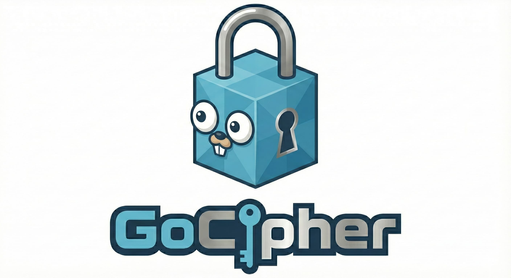

<p align="center">
  
</p>

# GoCipher

[](https://goreportcard.com/report/github.com/lucas-dehandschutter/gocipher)
[](LICENSE)
[](https://github.com/lucas-dehandschutter/gocipher/releases/latest)

GoCipher is a secure, lightweight command-line interface (CLI) tool written in Go for encrypting and decrypting strings and files. It uses **AES-256-GCM** with **Argon2id** key derivation to ensure your data remains safe.

## Features

*   **Strong Encryption**: Uses AES-256-GCM for authenticated encryption.
*   **Secure Key Derivation**: Derives keys from passwords using Argon2id (resists GPU/ASIC brute-force attacks).
*   **Chunked Streaming**: Encrypts and decrypts files in 64KB blocks, protected with AAD (Associated Data) to prevent truncation or data manipulation.
*   **Versatile**: Supports both direct string input and file encryption/decryption.
*   **Cross-Platform**: Runs on any system where Go is supported (Windows, macOS, Linux).

## Installation

### Via Go Install (Recommended)

```bash
go install github.com/lucas-dehandschutter/gocipher@latest
```

### From Source

1.  Clone the repository:
    ```bash
    git clone https://github.com/lucas-dehandschutter/gocipher.git
    cd gocipher
    ```

2.  Build the binary:
    ```bash
    go build -o gocipher
    ```

3.  (Optional) Install to your `$GOPATH/bin`:
    ```bash
    go install
    ```

## Usage

Run the tool using the built binary `./gocipher` or directly with `go run main.go`.

### Flags

*   `-s, --string`: Input string to encrypt/decrypt.
*   `-f, --file`: Path to the file to encrypt/decrypt.
*   `-d, --decrypt`: Enable decryption mode (default is encryption).
*   `-t, --time`: Argon2id time parameter (iterations, default: 3).
*   `-m, --memory`: Argon2id memory parameter in KB (default: 65536, which is 64MB).
*   `-p, --threads`: Argon2id threads parameter (parallelism, default: 4).

### Examples

#### 1. Encrypt a String

Encrypts a text string. You will be prompted to enter a password.

```bash
./gocipher -s "Secret Message"
# Output: <hex-encoded-ciphertext>
```

#### 2. Decrypt a String

Decrypts a hex-encoded string. **Note: The `-d` flag should come before the string input or use the `-s` flag explicitly.**

```bash
./gocipher -d -s "<hex-encoded-ciphertext>"
```

#### 3. Encrypt a File

Encrypts a file (e.g., `document.txt`). The output will be saved as `document.txt.enc`.

```bash
./gocipher -f document.txt
```

#### 4. Decrypt a File

Decrypts an encrypted file (e.g., `document.txt.enc`). The output will be saved as `document.txt` (or `.dec` if the extension differs).

```bash
# Important: Place flags before the filename or use -f
./gocipher -d -f document.txt.enc
```

## Security Details

*   **Algorithm**: AES-256-GCM (Galois/Counter Mode).
*   **Key Derivation**: Argon2id.
    *   Time (Iterations): 3
    *   Memory: 64 MB (65,536 KB)
    *   Threads (Parallelism): 4
    *   Salt: 16 bytes (randomly generated per encryption)
*   **Nonce**: 12 bytes (randomly generated per block)
*   **Header Format** (32 bytes):
    *   Magic Bytes: `GOC` (3 bytes)
    *   Format Version: `0x02` (1 byte)
    *   Argon2id Time: `uint32` (4 bytes, BigEndian)
    *   Argon2id Memory: `uint32` (4 bytes, BigEndian)
    *   Argon2id Threads: `uint8` (1 byte)
    *   Reserved: `3 bytes` (padding for alignment/future use, set to 0)
    *   Salt: `16 bytes`
*   **Streaming Format**: Chunked streaming (64KB chunks) with "Marked Terminal Chunk" logic to prevent truncation and block relocation attacks.

## License

[Apache 2.0 License](LICENSE)
